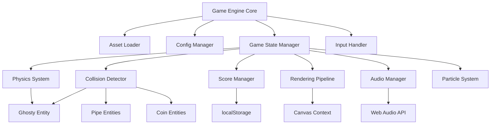

# Design Document: Flappy Kiro

## Overview

Flappy Kiro is an HTML5 Canvas-based endless side-scrolling game implemented in vanilla JavaScript. The architecture follows a modular design with distinct subsystems for physics, rendering, collision detection, audio, and visual effects. The game engine uses a traditional game loop pattern with requestAnimationFrame for smooth 60 FPS gameplay.

The core design philosophy emphasizes:
- **Separation of concerns**: Each subsystem has a single, well-defined responsibility
- **Configuration-driven gameplay**: All tuneable parameters externalized to config.js
- **Asset-based rendering**: All visuals use provided hand-drawn assets without procedural generation
- **State machine pattern**: Clear game state transitions (main menu → playing → paused/game over)
- **Performance optimization**: Efficient object pooling and culling for smooth gameplay

## Architecture

### High-Level System Architecture



### Module Responsibilities

**Game Engine Core**
- Orchestrates the main game loop using requestAnimationFrame
- Manages initialization sequence and asset loading
- Coordinates state transitions between subsystems
- Handles frame timing and delta time calculations

**Asset Loader**
- Loads all image assets (background, ghosty, palette)
- Loads all audio assets (jump, game_over)
- Provides promise-based loading with progress tracking
- Ensures all assets are ready before game start

**Config Manager**
- Loads configuration from config.js
- Provides read-only access to game parameters
- Validates configuration completeness on load
- Serves as single source of truth for all tuneable values

**Game State Manager**
- Implements state machine for game modes (MENU, PLAYING, PAUSED, GAME_OVER)
- Manages state transitions and state-specific update/render logic
- Coordinates subsystem activation/deactivation per state
- Handles state-specific input routing

**Input Handler**
- Listens for keyboard events (spacebar, pause key)
- Listens for mouse/touch events on canvas
- Translates raw input into game actions (flap, pause, restart)
- Provides input buffering for responsive controls

**Physics System**
- Applies gravity acceleration to Ghosty each frame
- Processes flap velocity impulses
- Clamps velocity to terminal velocity
- Updates Ghosty position with smooth interpolation
- Maintains momentum across frames

**Collision Detector**
- Performs AABB (Axis-Aligned Bounding Box) collision checks
- Detects Ghosty-Pipe intersections
- Detects Ghosty-Coin intersections
- Detects boundary collisions (top/bottom of canvas)
- Respects invincibility frames

**Score Manager**
- Tracks current score, high score, and lives
- Awards points for pipe passes and coin collection
- Persists high score to localStorage
- Triggers score popup animations
- Manages lives decrement and game over condition

**Rendering Pipeline**
- Renders all game elements in correct z-order
- Applies screen shake offset when active
- Handles sprite rendering with proper scaling
- Renders UI elements (score bar, text overlays)
- Maintains pixel-perfect rendering without anti-aliasing

**Audio Manager**
- Plays sound effects on game events
- Manages background music loop
- Handles audio pause/resume on state changes
- Provides volume control and muting capability

**Particle System**
- Generates particles behind Ghosty during flight
- Updates particle positions and opacity over lifetime
- Culls expired particles
- Renders particles with configured colors

## Components and Interfaces

### Core Game Engine

```javascript
class GameEngine {
  constructor(canvasId)
  init(): Promise<void>
  start(): void
  stop(): void
  update(deltaTime: number): void
  render(): void
  changeState(newState: GameState): void
}
```

**Responsibilities:**
- Initialize all subsystems in correct order
- Run main game loop at 60 FPS
- Delegate update/render to active subsystems
- Manage state transitions

**Key Methods:**
- `init()`: Load assets, initialize config, create subsystems
- `start()`: Begin game loop with requestAnimationFrame
- `update(deltaTime)`: Update all active subsystems with frame time
- `render()`: Render all visible elements to canvas
- `changeState(newState)`: Transition between game states

### Asset Loader

```javascript
class AssetLoader {
  loadImage(path: string): Promise<HTMLImageElement>
  loadAudio(path: string): Promise<HTMLAudioElement>
  loadAll(manifest: AssetManifest): Promise<AssetCollection>
  getAsset(name: string): HTMLImageElement | HTMLAudioElement
}
```

**Asset Manifest:**
```javascript
{
  images: {
    background: 'assets/background.png',
    ghosty: 'assets/ghosty.png',
    palette: 'assets/assets_palette.png'
  },
  audio: {
    jump: 'assets/jump.wav',
    gameOver: 'assets/game_over.wav'
  }
}
```

**Responsibilities:**
- Load all assets before game starts
- Provide synchronous access to loaded assets
- Handle loading errors gracefully

### Config Manager

```javascript
class ConfigManager {
  load(configObject: GameConfig): void
  get(key: string): any
  getPhysics(): PhysicsConfig
  getPipes(): PipeConfig
  getScoring(): ScoringConfig
  getParticles(): ParticleConfig
  getEffects(): EffectsConfig
}
```

**Configuration Structure:**
```javascript
{
  physics: {
    gravity: 0.6,
    flapVelocity: -10,
    terminalVelocity: 12
  },
  pipes: {
    speed: 2,
    gapSize: 150,
    spawnInterval: 2000,
    minGapY: 100,
    maxGapY: 400
  },
  scoring: {
    initialLives: 3,
    pipePassPoints: 1,
    coinPoints: 5,
    coinSpawnProbability: 0.3
  },
  particles: {
    emissionRate: 5,
    lifetime: 30,
    maxCount: 100,
    colors: ['#ff6b6b', '#4ecdc4', '#ffe66d']
  },
  effects: {
    screenShakeDuration: 300,
    screenShakeIntensity: 10,
    invincibilityDuration: 1000
  }
}
```

### Physics System

```javascript
class PhysicsSystem {
  update(entity: PhysicsEntity, deltaTime: number): void
  applyGravity(entity: PhysicsEntity, deltaTime: number): void
  applyFlap(entity: PhysicsEntity): void
  clampVelocity(entity: PhysicsEntity): void
  updatePosition(entity: PhysicsEntity, deltaTime: number): void
}
```

**PhysicsEntity Interface:**
```javascript
{
  x: number,
  y: number,
  velocityY: number,
  width: number,
  height: number
}
```

**Physics Calculations:**
- Gravity: `velocityY += gravity * deltaTime`
- Flap: `velocityY = flapVelocity`
- Terminal velocity: `velocityY = Math.min(velocityY, terminalVelocity)`
- Position: `y += velocityY * deltaTime`

### Collision Detector

```javascript
class CollisionDetector {
  checkPipeCollision(ghosty: Entity, pipes: Pipe[]): boolean
  checkCoinCollision(ghosty: Entity, coins: Coin[]): Coin | null
  checkBoundaryCollision(ghosty: Entity, canvasHeight: number): boolean
  aabbIntersect(a: BoundingBox, b: BoundingBox): boolean
}
```

**BoundingBox Interface:**
```javascript
{
  x: number,
  y: number,
  width: number,
  height: number
}
```

**Collision Algorithm:**
- AABB (Axis-Aligned Bounding Box) intersection test
- Returns true if rectangles overlap on both axes
- Optimized with early exit for non-overlapping cases

### Game Entities

**Ghosty Entity:**
```javascript
class Ghosty {
  x: number
  y: number
  velocityY: number
  width: number
  height: number
  lives: number
  invincible: boolean
  invincibilityTimer: number
  
  update(deltaTime: number): void
  flap(): void
  takeDamage(): void
  render(ctx: CanvasRenderingContext2D, sprite: HTMLImageElement): void
}
```

**Pipe Entity:**
```javascript
class Pipe {
  x: number
  gapY: number
  gapSize: number
  width: number
  passed: boolean
  
  update(deltaTime: number, speed: number): void
  render(ctx: CanvasRenderingContext2D, sprites: SpriteSheet): void
  isOffScreen(canvasWidth: number): boolean
  getBoundingBoxes(): BoundingBox[]
}
```

**Coin Entity:**
```javascript
class Coin {
  x: number
  y: number
  width: number
  height: number
  collected: boolean
  
  update(deltaTime: number, speed: number): void
  render(ctx: CanvasRenderingContext2D, sprite: HTMLImageElement): void
  isOffScreen(canvasWidth: number): boolean
}
```

### Score Manager

```javascript
class ScoreManager {
  currentScore: number
  highScore: number
  lives: number
  
  addScore(points: number): void
  decrementLives(): void
  resetScore(): void
  loadHighScore(): void
  saveHighScore(): void
  isGameOver(): boolean
}
```

**localStorage Schema:**
```javascript
{
  'flappyKiro_highScore': number
}
```

### Audio Manager

```javascript
class AudioManager {
  playSound(soundName: string): void
  playMusic(musicName: string, loop: boolean): void
  pauseMusic(): void
  resumeMusic(): void
  setVolume(volume: number): void
  mute(): void
  unmute(): void
}
```

**Sound Effects:**
- `jump`: Played on flap action
- `collision`: Played on pipe/boundary collision
- `coin`: Played on coin collection
- `score`: Played on pipe pass
- `gameOver`: Played on game over transition

### Particle System

```javascript
class ParticleSystem {
  particles: Particle[]
  
  emit(x: number, y: number, count: number): void
  update(deltaTime: number): void
  render(ctx: CanvasRenderingContext2D): void
  clear(): void
}
```

**Particle Interface:**
```javascript
{
  x: number,
  y: number,
  velocityX: number,
  velocityY: number,
  color: string,
  lifetime: number,
  maxLifetime: number,
  size: number
}
```

**Particle Behavior:**
- Emitted behind Ghosty at configured rate
- Move in random directions with slight leftward bias
- Fade out as lifetime decreases
- Removed when lifetime reaches zero

### Rendering Pipeline

```javascript
class RenderingPipeline {
  ctx: CanvasRenderingContext2D
  screenShakeOffset: {x: number, y: number}
  
  clear(): void
  applyScreenShake(intensity: number): void
  renderBackground(image: HTMLImageElement): void
  renderClouds(clouds: Cloud[]): void
  renderPipes(pipes: Pipe[]): void
  renderCoins(coins: Coin[]): void
  renderGhosty(ghosty: Ghosty): void
  renderParticles(particles: Particle[]): void
  renderUI(score: number, lives: number, highScore: number): void
  renderText(text: string, x: number, y: number, options: TextOptions): void
}
```

**Rendering Order (back to front):**
1. Background image
2. Parallax clouds
3. Pipes
4. Coins
5. Particles
6. Ghosty
7. UI elements (score bar, overlays)

### Game State Manager

```javascript
class GameStateManager {
  currentState: GameState
  
  changeState(newState: GameState): void
  update(deltaTime: number): void
  render(): void
  handleInput(input: InputEvent): void
}
```

**GameState Enum:**
```javascript
{
  MENU: 'menu',
  PLAYING: 'playing',
  PAUSED: 'paused',
  GAME_OVER: 'gameOver'
}
```

**State Transition Logic:**
- MENU → PLAYING: On flap input
- PLAYING → PAUSED: On pause input
- PLAYING → GAME_OVER: When lives reach zero
- PAUSED → PLAYING: On pause input
- GAME_OVER → MENU: On flap input

## Data Models

### Game State Data

```javascript
{
  state: GameState,
  ghosty: Ghosty,
  pipes: Pipe[],
  coins: Coin[],
  clouds: Cloud[],
  score: number,
  lives: number,
  highScore: number,
  pipeSpawnTimer: number,
  screenShakeTimer: number,
  invincibilityTimer: number
}
```

### Sprite Sheet Mapping

The `assets_palette.png` contains multiple sprites that need to be extracted:

```javascript
{
  pipeBody: { x: 0, y: 0, width: 52, height: 320 },
  pipeCapTop: { x: 56, y: 0, width: 52, height: 24 },
  pipeCapBottom: { x: 56, y: 28, width: 52, height: 24 },
  coin: { x: 112, y: 0, width: 24, height: 24 },
  cloud: { x: 140, y: 0, width: 48, height: 24 }
}
```

### Configuration Data Model

See Config Manager section for complete configuration structure.

## Correctness Properties

*A property is a characteristic or behavior that should hold true across all valid executions of a system—essentially, a formal statement about what the system should do. Properties serve as the bridge between human-readable specifications and machine-verifiable correctness guarantees.*

Before writing correctness properties, I need to analyze the acceptance criteria to determine which are suitable for property-based testing.

