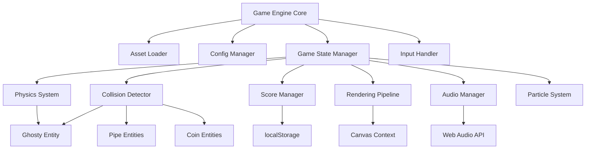

# Design Document: Flappy Kiro

## Overview

<<<<<<< HEAD
Flappy Kiro is an HTML5 Canvas-based endless side-scrolling game implemented in vanilla JavaScript. The architecture follows a modular design with distinct subsystems for physics, rendering, collision detection, audio, and visual effects. The game engine uses a traditional game loop pattern with requestAnimationFrame for smooth 60 FPS gameplay.

The core design philosophy emphasizes:
- **Separation of concerns**: Each subsystem has a single, well-defined responsibility
- **Configuration-driven gameplay**: All tuneable parameters externalized to config.js
- **Asset-based rendering**: All visuals use provided hand-drawn assets without procedural generation
- **State machine pattern**: Clear game state transitions (main menu → playing → paused/game over)
- **Performance optimization**: Efficient object pooling and culling for smooth gameplay

## Architecture

### High-Level System Architecture



### Module Responsibilities

**Game Engine Core**
- Orchestrates the main game loop using requestAnimationFrame
- Manages initialization sequence and asset loading
- Coordinates state transitions between subsystems
- Handles frame timing and delta time calculations

**Asset Loader**
- Loads all image assets (background, ghosty, palette)
- Loads all audio assets (jump, game_over)
- Provides promise-based loading with progress tracking
- Ensures all assets are ready before game start

**Config Manager**
- Loads configuration from config.js
- Provides read-only access to game parameters
- Validates configuration completeness on load
- Serves as single source of truth for all tuneable values

**Game State Manager**
- Implements state machine for game modes (MENU, PLAYING, PAUSED, GAME_OVER)
- Manages state transitions and state-specific update/render logic
- Coordinates subsystem activation/deactivation per state
- Handles state-specific input routing

**Input Handler**
- Listens for keyboard events (spacebar, pause key)
- Listens for mouse/touch events on canvas
- Translates raw input into game actions (flap, pause, restart)
- Provides input buffering for responsive controls

**Physics System**
- Applies gravity acceleration to Ghosty each frame
- Processes flap velocity impulses
- Clamps velocity to terminal velocity
- Updates Ghosty position with smooth interpolation
- Maintains momentum across frames

**Collision Detector**
- Performs AABB (Axis-Aligned Bounding Box) collision checks
- Detects Ghosty-Pipe intersections
- Detects Ghosty-Coin intersections
- Detects boundary collisions (top/bottom of canvas)
- Respects invincibility frames

**Score Manager**
- Tracks current score, high score, and lives
- Awards points for pipe passes and coin collection
- Persists high score to localStorage
- Triggers score popup animations
- Manages lives decrement and game over condition

**Rendering Pipeline**
- Renders all game elements in correct z-order
- Applies screen shake offset when active
- Handles sprite rendering with proper scaling
- Renders UI elements (score bar, text overlays)
- Maintains pixel-perfect rendering without anti-aliasing

**Audio Manager**
- Plays sound effects on game events
- Manages background music loop
- Handles audio pause/resume on state changes
- Provides volume control and muting capability

**Particle System**
- Generates particles behind Ghosty during flight
- Updates particle positions and opacity over lifetime
- Culls expired particles
- Renders particles with configured colors

## Components and Interfaces

### Core Game Engine

```javascript
class GameEngine {
  constructor(canvasId)
  init(): Promise<void>
  start(): void
  stop(): void
  update(deltaTime: number): void
  render(): void
  changeState(newState: GameState): void
}
```

**Responsibilities:**
- Initialize all subsystems in correct order
- Run main game loop at 60 FPS
- Delegate update/render to active subsystems
- Manage state transitions

**Key Methods:**
- `init()`: Load assets, initialize config, create subsystems
- `start()`: Begin game loop with requestAnimationFrame
- `update(deltaTime)`: Update all active subsystems with frame time
- `render()`: Render all visible elements to canvas
- `changeState(newState)`: Transition between game states

### Asset Loader

```javascript
class AssetLoader {
  loadImage(path: string): Promise<HTMLImageElement>
  loadAudio(path: string): Promise<HTMLAudioElement>
  loadAll(manifest: AssetManifest): Promise<AssetCollection>
  getAsset(name: string): HTMLImageElement | HTMLAudioElement
}
```

**Asset Manifest:**
```javascript
{
  images: {
    background: 'assets/background.png',
    ghosty: 'assets/ghosty.png',
    palette: 'assets/assets_palette.png'
  },
  audio: {
    jump: 'assets/jump.wav',
    gameOver: 'assets/game_over.wav'
  }
}
```

**Responsibilities:**
- Load all assets before game starts
- Provide synchronous access to loaded assets
- Handle loading errors gracefully

### Config Manager

```javascript
class ConfigManager {
  load(configObject: GameConfig): void
  get(key: string): any
  getPhysics(): PhysicsConfig
  getPipes(): PipeConfig
  getScoring(): ScoringConfig
  getParticles(): ParticleConfig
  getEffects(): EffectsConfig
}
```

**Configuration Structure:**
```javascript
{
  physics: {
    gravity: 0.6,
    flapVelocity: -10,
    terminalVelocity: 12
  },
  pipes: {
    speed: 2,
    gapSize: 150,
    spawnInterval: 2000,
    minGapY: 100,
    maxGapY: 400
  },
  scoring: {
    initialLives: 3,
    pipePassPoints: 1,
    coinPoints: 5,
    coinSpawnProbability: 0.3
  },
  particles: {
    emissionRate: 5,
    lifetime: 30,
    maxCount: 100,
    colors: ['#ff6b6b', '#4ecdc4', '#ffe66d']
  },
  effects: {
    screenShakeDuration: 300,
    screenShakeIntensity: 10,
    invincibilityDuration: 1000
  }
}
```

### Physics System

```javascript
class PhysicsSystem {
  update(entity: PhysicsEntity, deltaTime: number): void
  applyGravity(entity: PhysicsEntity, deltaTime: number): void
  applyFlap(entity: PhysicsEntity): void
  clampVelocity(entity: PhysicsEntity): void
  updatePosition(entity: PhysicsEntity, deltaTime: number): void
}
```

**PhysicsEntity Interface:**
```javascript
{
  x: number,
  y: number,
  velocityY: number,
  width: number,
  height: number
}
```

**Physics Calculations:**
- Gravity: `velocityY += gravity * deltaTime`
- Flap: `velocityY = flapVelocity`
- Terminal velocity: `velocityY = Math.min(velocityY, terminalVelocity)`
- Position: `y += velocityY * deltaTime`

### Collision Detector

```javascript
class CollisionDetector {
  checkPipeCollision(ghosty: Entity, pipes: Pipe[]): boolean
  checkCoinCollision(ghosty: Entity, coins: Coin[]): Coin | null
  checkBoundaryCollision(ghosty: Entity, canvasHeight: number): boolean
  aabbIntersect(a: BoundingBox, b: BoundingBox): boolean
}
```

**BoundingBox Interface:**
```javascript
{
  x: number,
  y: number,
  width: number,
  height: number
}
```

**Collision Algorithm:**
- AABB (Axis-Aligned Bounding Box) intersection test
- Returns true if rectangles overlap on both axes
- Optimized with early exit for non-overlapping cases

### Game Entities

**Ghosty Entity:**
```javascript
class Ghosty {
  x: number
  y: number
  velocityY: number
  width: number
  height: number
  lives: number
  invincible: boolean
  invincibilityTimer: number
  
  update(deltaTime: number): void
  flap(): void
  takeDamage(): void
  render(ctx: CanvasRenderingContext2D, sprite: HTMLImageElement): void
}
```

**Pipe Entity:**
```javascript
class Pipe {
  x: number
  gapY: number
  gapSize: number
  width: number
  passed: boolean
  
  update(deltaTime: number, speed: number): void
  render(ctx: CanvasRenderingContext2D, sprites: SpriteSheet): void
  isOffScreen(canvasWidth: number): boolean
  getBoundingBoxes(): BoundingBox[]
}
```

**Coin Entity:**
```javascript
class Coin {
  x: number
  y: number
  width: number
  height: number
  collected: boolean
  
  update(deltaTime: number, speed: number): void
  render(ctx: CanvasRenderingContext2D, sprite: HTMLImageElement): void
  isOffScreen(canvasWidth: number): boolean
}
```

### Score Manager

```javascript
class ScoreManager {
  currentScore: number
  highScore: number
  lives: number
  
  addScore(points: number): void
  decrementLives(): void
  resetScore(): void
  loadHighScore(): void
  saveHighScore(): void
  isGameOver(): boolean
}
```

**localStorage Schema:**
```javascript
{
  'flappyKiro_highScore': number
}
```

### Audio Manager

```javascript
class AudioManager {
  playSound(soundName: string): void
  playMusic(musicName: string, loop: boolean): void
  pauseMusic(): void
  resumeMusic(): void
  setVolume(volume: number): void
  mute(): void
  unmute(): void
}
```

**Sound Effects:**
- `jump`: Played on flap action
- `collision`: Played on pipe/boundary collision
- `coin`: Played on coin collection
- `score`: Played on pipe pass
- `gameOver`: Played on game over transition

### Particle System

```javascript
class ParticleSystem {
  particles: Particle[]
  
  emit(x: number, y: number, count: number): void
  update(deltaTime: number): void
  render(ctx: CanvasRenderingContext2D): void
  clear(): void
}
```

**Particle Interface:**
```javascript
{
  x: number,
  y: number,
  velocityX: number,
  velocityY: number,
  color: string,
  lifetime: number,
  maxLifetime: number,
  size: number
}
```

**Particle Behavior:**
- Emitted behind Ghosty at configured rate
- Move in random directions with slight leftward bias
- Fade out as lifetime decreases
- Removed when lifetime reaches zero

### Rendering Pipeline

```javascript
class RenderingPipeline {
  ctx: CanvasRenderingContext2D
  screenShakeOffset: {x: number, y: number}
  
  clear(): void
  applyScreenShake(intensity: number): void
  renderBackground(image: HTMLImageElement): void
  renderClouds(clouds: Cloud[]): void
  renderPipes(pipes: Pipe[]): void
  renderCoins(coins: Coin[]): void
  renderGhosty(ghosty: Ghosty): void
  renderParticles(particles: Particle[]): void
  renderUI(score: number, lives: number, highScore: number): void
  renderText(text: string, x: number, y: number, options: TextOptions): void
}
```

**Rendering Order (back to front):**
1. Background image
2. Parallax clouds
3. Pipes
4. Coins
5. Particles
6. Ghosty
7. UI elements (score bar, overlays)

### Game State Manager

```javascript
class GameStateManager {
  currentState: GameState
  
  changeState(newState: GameState): void
  update(deltaTime: number): void
  render(): void
  handleInput(input: InputEvent): void
}
```

**GameState Enum:**
```javascript
{
  MENU: 'menu',
  PLAYING: 'playing',
  PAUSED: 'paused',
  GAME_OVER: 'gameOver'
}
```

**State Transition Logic:**
- MENU → PLAYING: On flap input
- PLAYING → PAUSED: On pause input
- PLAYING → GAME_OVER: When lives reach zero
- PAUSED → PLAYING: On pause input
- GAME_OVER → MENU: On flap input

## Data Models

### Game State Data

```javascript
{
  state: GameState,
  ghosty: Ghosty,
  pipes: Pipe[],
  coins: Coin[],
=======
Flappy Kiro is a browser-based endless side-scroller built entirely with HTML5 Canvas and vanilla JavaScript — no frameworks, no bundlers, no external dependencies. The player controls Ghosty, a ghost sprite that flaps through gaps between pipe pairs while collecting coins and surviving collisions via a lives system.

The architecture is a collection of single-responsibility ES modules coordinated by a central game loop in `game.js`. All tuneable constants live in `config.js`. The game targets 60 fps via `requestAnimationFrame` with delta-time physics so it runs correctly at any frame rate.

### Key Design Goals

- **Zero dependencies** — everything runs from a single `index.html` opened in a browser
- **Centralized config** — `config.js` is the only place magic numbers live
- **Module separation** — each subsystem is its own file with a clear public API
- **Delta-time physics** — frame-rate-independent movement throughout
- **Progressive difficulty** — pipe speed scales with score milestones

---

## Architecture

### High-Level Module Graph

```
index.html
  └── game.js  (entry point, owns the game loop)
        ├── config.js          (constants — imported by all modules)
        ├── state.js           (GameStateMachine)
        ├── score.js           (ScoreManager)
        ├── physics.js         (PhysicsSystem — Ghosty movement)
        ├── obstacles.js       (ObstacleGenerator — pipe pairs)
        ├── coins.js           (CoinSystem)
        ├── particles.js       (ParticleSystem)
        ├── collision.js       (CollisionDetector)
        ├── audio.js           (AudioManager)
        └── renderer.js        (Renderer — all canvas drawing)
```

`game.js` owns the single `requestAnimationFrame` loop. Each frame it:
1. Computes `dt` (delta time in seconds)
2. Delegates updates to each subsystem in order
3. Delegates rendering to `Renderer`

No module imports another module except `config.js`. All cross-module communication flows through `game.js` via plain data objects passed as arguments.

---

## State Machine

The `GameStateMachine` in `state.js` owns the current state and exposes transition methods.

```
         ┌─────────────────────────────────────────────────────┐
         │                                                     │
         ▼                                                     │
      [MENU] ──── first input ────► [PLAYING] ──── pause ────► [PAUSED]
                                       │
                                       │  lives == 0
                                       ▼
                                  [GAME_OVER] ──── restart ────► [MENU]
```

### States

| State | Description |
|---|---|
| `MENU` | Initial state on load. Shows title, high score, start prompt. Game loop runs but physics/obstacles are frozen. |
| `PLAYING` | Active gameplay. All subsystems update each frame. |
| `PAUSED` | Physics and obstacle updates are frozen. Renderer draws a pause overlay. |
| `GAME_OVER` | Shows final score, high score, restart prompt. Subsystems frozen. |

### Transitions

| From | Event | To |
|---|---|---|
| `MENU` | Any input (Space / tap) | `PLAYING` |
| `PLAYING` | Pause key (P / Escape) | `PAUSED` |
| `PAUSED` | Pause key again | `PLAYING` |
| `PLAYING` | Lives reach 0 | `GAME_OVER` |
| `GAME_OVER` | Any input | `MENU` (resets all state) |

---

## Components and Interfaces

### `config.js`

Exports a frozen object of all tuneable constants. No logic — pure data.

```js
export const GRAVITY = 1800;            // px/s²
export const FLAP_VELOCITY = -520;      // px/s (negative = upward)
export const TERMINAL_VELOCITY = 700;   // px/s (max downward)
export const PIPE_SPEED_INITIAL = 200;  // px/s
export const PIPE_SPEED_INCREMENT = 20; // px/s per milestone
export const PIPE_SPEED_MAX = 400;      // px/s
export const PIPE_SPAWN_INTERVAL = 1.8; // seconds
export const GAP_SIZE = 160;            // px
export const GAP_VERTICAL_MIN = 120;    // px from top (gap center min)
export const GAP_VERTICAL_MAX = 380;    // px from top (gap center max)
export const CLOUD_SPEED = 40;          // px/s
export const CLOUD_COUNT = 5;
export const LIVES_INITIAL = 3;
export const INVINCIBILITY_DURATION = 2000; // ms
export const COIN_SCORE_VALUE = 5;
export const PIPE_SCORE_VALUE = 1;
export const SPEED_MILESTONE = 5;       // score points per speed increment
export const PARTICLE_COUNT = 3;        // particles emitted per frame
export const PARTICLE_LIFETIME = 400;   // ms
export const SCREEN_SHAKE_DURATION = 300; // ms
export const SCREEN_SHAKE_INTENSITY = 8;  // px offset
```

### `state.js` — GameStateMachine

```js
class GameStateMachine {
  constructor()
  get current()                    // → 'MENU' | 'PLAYING' | 'PAUSED' | 'GAME_OVER'
  isPlaying()                      // → boolean
  startGame()                      // MENU → PLAYING
  pause()                          // PLAYING → PAUSED
  resume()                         // PAUSED → PLAYING
  gameOver()                       // PLAYING → GAME_OVER
  reset()                          // any → MENU
}
```

### `score.js` — ScoreManager

```js
class ScoreManager {
  constructor()
  get score()                      // → number
  get lives()                      // → number
  get highScore()                  // → number
  addPipeScore()                   // score += PIPE_SCORE_VALUE
  addCoinScore()                   // score += COIN_SCORE_VALUE
  loseLife()                       // lives -= 1; returns new lives count
  reset()                          // score = 0, lives = LIVES_INITIAL
  saveHighScore()                  // persists to localStorage
  loadHighScore()                  // reads from localStorage
  getCurrentPipeSpeed()            // → computed speed based on score milestones
}
```

### `physics.js` — PhysicsSystem

Manages Ghosty's position and velocity. Stateless update function — takes current state, returns new state.

```js
class PhysicsSystem {
  constructor(canvasHeight)
  get ghosty()                     // → GhostyState
  flap()                           // sets vy = FLAP_VELOCITY
  update(dt)                       // applies gravity, clamps terminal velocity, updates position
  reset()                          // restores initial position and velocity
  getHitbox()                      // → AABB { x, y, w, h }
}
```

`GhostyState`:
```js
{
  x: number,      // fixed horizontal position (canvas center-left)
  y: number,      // current vertical position (top of sprite)
  vy: number,     // vertical velocity (px/s, positive = downward)
  width: number,  // sprite width
  height: number  // sprite height
}
```

### `obstacles.js` — ObstacleGenerator

```js
class ObstacleGenerator {
  constructor()
  get pipes()                      // → PipePair[]
  update(dt, pipeSpeed)            // moves pipes left, spawns new ones, culls off-screen
  reset()                          // clears all pipes, resets spawn timer
  checkScored(ghostyX)             // → number of pipes Ghosty just passed (for scoring)
}
```

`PipePair`:
```js
{
  x: number,          // left edge of pipe column
  gapCenterY: number, // vertical center of the gap
  width: number,      // pipe width in px
  scored: boolean     // true once Ghosty has passed this pipe
}
```

Gap bounds derived from `PipePair`:
- `gapTop = gapCenterY - GAP_SIZE / 2`
- `gapBottom = gapCenterY + GAP_SIZE / 2`
- Top pipe: `y=0` to `y=gapTop`
- Bottom pipe: `y=gapBottom` to `y=canvasHeight - SCORE_BAR_HEIGHT`

### `coins.js` — CoinSystem

```js
class CoinSystem {
  constructor()
  get coins()                      // → Coin[]
  spawnForPipe(pipe)               // spawns 0–1 coins within the pipe's gap
  update(dt, pipeSpeed)            // moves coins left with pipes
  collect(coinId)                  // removes coin by id
  reset()                          // clears all coins
}
```

`Coin`:
```js
{
  id: number,
  x: number,
  y: number,
  radius: number,
  collected: boolean
}
```

### `particles.js` — ParticleSystem

```js
class ParticleSystem {
  constructor()
  emit(x, y)                       // spawns PARTICLE_COUNT particles at position
  update(dt)                       // advances lifetime, removes expired particles
  get particles()                  // → Particle[]
  reset()
}
```

`Particle`:
```js
{
  x: number,
  y: number,
  vx: number,   // horizontal drift velocity
  vy: number,   // vertical drift velocity
  life: number, // remaining lifetime in ms
  alpha: number // opacity (derived from life / PARTICLE_LIFETIME)
}
```

### `collision.js` — CollisionDetector

Pure functions — no state.

```js
// AABB overlap test
function aabbOverlap(a, b)         // → boolean  (a,b: {x,y,w,h})

// Ghosty vs pipe pair
function checkPipeCollision(ghostyHitbox, pipe, canvasHeight, scoreBarHeight)  // → boolean

// Ghosty vs canvas boundaries
function checkBoundaryCollision(ghostyHitbox, canvasHeight, scoreBarHeight)    // → boolean

// Ghosty vs coin (circle vs AABB)
function checkCoinCollision(ghostyHitbox, coin)  // → boolean
```

### `audio.js` — AudioManager

```js
class AudioManager {
  constructor()
  init()                           // loads/creates audio resources
  playFlap()
  playScore()
  playCollision()
  playCoin()
  startMusic()
  stopMusic()
  setMuted(muted)
}
```

Audio sources:
- `assets/jump.wav` → flap sound
- `assets/game_over.wav` → collision sound
- Score and coin sounds: generated via Web Audio API (short synthesized tones) as fallback if no dedicated files exist
- Background music: looping Web Audio API oscillator-based ambient track

### `renderer.js` — Renderer

All canvas drawing lives here. Receives read-only data from `game.js` each frame.

```js
class Renderer {
  constructor(canvas, ctx)
  drawBackground(clouds)
  drawPipes(pipes, canvasHeight, scoreBarHeight)
  drawCoins(coins)
  drawGhosty(ghosty, ghostyImage, isInvincible)
  drawParticles(particles)
  drawHUD(score, lives, highScore)
  drawScoreBar(score, lives, highScore)
  drawScorePopups(popups)
  drawMenuScreen(highScore)
  drawPauseOverlay()
  drawGameOverScreen(score, highScore)
  applyScreenShake(shakeState)     // translates canvas context
  clearShake()
}
```

### `game.js` — Entry Point & Game Loop

```js
// Owns all subsystem instances
// Owns the rAF loop
// Wires input events to subsystems
// Passes data between subsystems each frame

function init()
function gameLoop(timestamp)
function handleInput(event)
function resetGame()
```

---

## Data Models

### GameState (assembled in `game.js` each frame for renderer)

```js
{
  state: 'MENU' | 'PLAYING' | 'PAUSED' | 'GAME_OVER',
  ghosty: GhostyState,
  pipes: PipePair[],
  coins: Coin[],
  particles: Particle[],
>>>>>>> ad3a836 (Tasks completed)
  clouds: Cloud[],
  score: number,
  lives: number,
  highScore: number,
<<<<<<< HEAD
  pipeSpawnTimer: number,
  screenShakeTimer: number,
  invincibilityTimer: number
}
```

### Sprite Sheet Mapping

The `assets_palette.png` contains multiple sprites that need to be extracted:

```javascript
{
  pipeBody: { x: 0, y: 0, width: 52, height: 320 },
  pipeCapTop: { x: 56, y: 0, width: 52, height: 24 },
  pipeCapBottom: { x: 56, y: 28, width: 52, height: 24 },
  coin: { x: 112, y: 0, width: 24, height: 24 },
  cloud: { x: 140, y: 0, width: 48, height: 24 }
}
```

### Configuration Data Model

See Config Manager section for complete configuration structure.

## Correctness Properties

*A property is a characteristic or behavior that should hold true across all valid executions of a system—essentially, a formal statement about what the system should do. Properties serve as the bridge between human-readable specifications and machine-verifiable correctness guarantees.*

Before writing correctness properties, I need to analyze the acceptance criteria to determine which are suitable for property-based testing.

=======
  shakeState: { active: boolean, remaining: number, intensity: number },
  scorePopups: ScorePopup[]
}
```

### Cloud

```js
{
  x: number,
  y: number,
  width: number,
  height: number
}
```

### ScorePopup

```js
{
  x: number,
  y: number,
  value: number,   // e.g. 1 for pipe, 5 for coin
  life: number,    // remaining display time in ms
  alpha: number
}
```

### ShakeState

```js
{
  active: boolean,
  remaining: number,   // ms remaining
  intensity: number,   // current pixel offset
  offsetX: number,     // computed each frame
  offsetY: number
}
```

---

## Rendering Pipeline

Each frame the renderer executes in this order:

```
1. applyScreenShake()          — translate canvas if shake is active
2. drawBackground(clouds)      — sky gradient + city skyline + circuit ground + scrolling clouds
3. drawPipes(pipes)            — pipe bodies + caps
4. drawCoins(coins)            — orange circular coins
5. drawParticles(particles)    — ghost trail particles
6. drawGhosty(ghosty)          — sprite (flicker if invincible)
7. drawScorePopups(popups)     — floating "+N" text
8. drawHUD(score,lives,hs)     — top bar: title + score display
9. drawScoreBar(score,lives,hs)— bottom bar: lives + score
10. clearShake()               — reset canvas transform
11. [overlay if not PLAYING]   — menu / pause / game over screen on top
```

### Background Layers (procedural, drawn once and cached to an offscreen canvas)

1. **Sky gradient** — `createLinearGradient` from top-left (day blue `#87CEEB`) to top-right (night dark `#1a1a2e`), filling the upper 70% of canvas
2. **City skyline silhouette** — dark grey rectangles of varying heights along the horizon line
3. **Circuit-board ground** — dark base (`#0d1117`) with neon green (`#00ff41`) horizontal and vertical lines, small square pads at intersections, filling the bottom 15% of canvas above the score bar

### Pipe Rendering

- Pipe body: filled rectangle, color interpolated from cyan-blue (`#00bcd4`) at low speed to purple (`#7c3aed`) at max speed based on `currentPipeSpeed / PIPE_SPEED_MAX`
- Pipe cap: slightly wider rectangle at the open end, darker shade of the body color
- Pipe outline: 2px stroke in a darker variant for pixel-art feel

### Ghosty Rendering

- Draw `ghostyImage` at `(ghosty.x, ghosty.y)` at natural dimensions
- When invincible: alternate opacity between 1.0 and 0.3 every 100ms (flicker effect)

---

## Game Loop Flow

```
gameLoop(timestamp):
  dt = min((timestamp - lastTimestamp) / 1000, 0.05)  // cap at 50ms to prevent spiral of death
  lastTimestamp = timestamp

  if state == PLAYING:
    physics.update(dt)
    obstacles.update(dt, score.getCurrentPipeSpeed())
    coins.update(dt, score.getCurrentPipeSpeed())
    particles.emit(ghosty.x, ghosty.y + ghosty.height/2)
    particles.update(dt)
    scorePopups.update(dt)
    shakeState.update(dt)

    // Collision checks
    for each pipe in obstacles.pipes:
      if collision.checkPipeCollision(physics.getHitbox(), pipe, ...):
        handleCollision()
        break

    if collision.checkBoundaryCollision(physics.getHitbox(), ...):
      handleCollision()

    for each coin in coins.coins:
      if collision.checkCoinCollision(physics.getHitbox(), coin):
        coins.collect(coin.id)
        score.addCoinScore()
        audio.playCoin()
        scorePopups.add(coin.x, coin.y, COIN_SCORE_VALUE)

    // Pipe scoring
    passed = obstacles.checkScored(physics.ghosty.x)
    for i in range(passed):
      score.addPipeScore()
      audio.playScore()
      scorePopups.add(pipeX, ghosty.y, PIPE_SCORE_VALUE)

    if score.lives == 0:
      score.saveHighScore()
      state.gameOver()

  renderer.render(assembleGameState())
  requestAnimationFrame(gameLoop)
```

### handleCollision()

```
if ghosty.isInvincible: return
score.loseLife()
audio.playCollision()
shakeState.start(SCREEN_SHAKE_DURATION, SCREEN_SHAKE_INTENSITY)
physics.triggerInvincibility(INVINCIBILITY_DURATION)
if score.lives == 0:
  score.saveHighScore()
  state.gameOver()
```

---

## Collision System

### Hitbox Definitions

**Ghosty AABB** — inset from sprite bounds to feel fair:
```
hitbox = {
  x: ghosty.x + ghosty.width * 0.15,
  y: ghosty.y + ghosty.height * 0.1,
  w: ghosty.width * 0.7,
  h: ghosty.height * 0.8
}
```

**Pipe AABB** (top pipe):
```
{ x: pipe.x, y: 0, w: pipe.width, h: gapTop }
```

**Pipe AABB** (bottom pipe):
```
{ x: pipe.x, y: gapBottom, w: pipe.width, h: canvasHeight - scoreBarHeight - gapBottom }
```

**Coin circle** — treated as AABB for simplicity:
```
{ x: coin.x - coin.radius, y: coin.y - coin.radius, w: coin.radius*2, h: coin.radius*2 }
```

### AABB Overlap Algorithm

```
function aabbOverlap(a, b):
  return a.x < b.x + b.w
      && a.x + a.w > b.x
      && a.y < b.y + b.h
      && a.y + a.h > b.y
```

### Boundary Detection

```
function checkBoundaryCollision(hitbox, canvasHeight, scoreBarHeight):
  return hitbox.y < 0
      || hitbox.y + hitbox.h > canvasHeight - scoreBarHeight
```

### Invincibility Frames

After a collision, `physics.js` sets `invincibilityRemaining = INVINCIBILITY_DURATION`. Each frame, `update(dt)` decrements it. Collision checks are skipped while `invincibilityRemaining > 0`.

---

## Audio System

### Strategy

The game ships with two audio files: `assets/jump.wav` (flap) and `assets/game_over.wav` (collision). Score and coin sounds are synthesized via the Web Audio API to avoid requiring additional asset files.

```
AudioManager:
  flapBuffer      ← decoded ArrayBuffer from jump.wav
  collisionBuffer ← decoded ArrayBuffer from game_over.wav
  audioCtx        ← new AudioContext()
  musicNode       ← OscillatorNode (ambient drone, looping)
```

### Sound Generation (Web Audio API)

- **Score sound**: Short ascending beep — 880 Hz sine wave, 80ms, gain envelope
- **Coin sound**: Higher ascending beep — 1200 Hz sine wave, 60ms, gain envelope
- **Background music**: Low-frequency oscillator (55 Hz) + filtered noise for ambient feel, looping

### Initialization

`AudioManager.init()` is called on first user interaction (to satisfy browser autoplay policy). It creates the `AudioContext` and decodes the WAV files via `fetch` + `decodeAudioData`.

### Mute

A mute toggle sets `audioCtx.suspend()` / `audioCtx.resume()` globally.

---

## File Structure

```
/
├── index.html          — single HTML page, loads config.js then game.js as modules
├── config.js           — all tuneable constants (ES module exports)
├── game.js             — game loop, input handling, subsystem wiring
├── renderer.js         — all canvas drawing
├── physics.js          — Ghosty physics (gravity, flap, terminal velocity)
├── obstacles.js        — pipe pair spawning and movement
├── coins.js            — coin spawning, movement, collection
├── particles.js        — particle trail system
├── audio.js            — Web Audio API sound management
├── collision.js        — pure AABB collision functions
├── state.js            — game state machine
├── score.js            — scoring, lives, localStorage persistence
└── assets/
    ├── ghosty.png      — Ghosty sprite
    ├── background.png  — reference image (not used directly)
    ├── assets_palette.png — color/sprite palette reference
    ├── jump.wav        — flap sound
    └── game_over.wav   — collision sound
```

### `index.html` Structure

```html
<!DOCTYPE html>
<html>
<head>
  <meta charset="UTF-8">
  <title>Flappy Kiro</title>
  <style>
    body { margin: 0; background: #000; display: flex; justify-content: center; align-items: center; height: 100vh; }
    canvas { display: block; image-rendering: pixelated; }
  </style>
</head>
<body>
  <canvas id="gameCanvas" width="480" height="640"></canvas>
  <script src="config.js"></script>
  <script type="module" src="game.js"></script>
</body>
</html>
```

Canvas is fixed at 480×640 px — a portrait aspect ratio matching the Flappy Bird style. All coordinate math uses these dimensions.

---

## Error Handling

| Scenario | Handling |
|---|---|
| `ghosty.png` fails to load | Log warning; draw a white rectangle as fallback sprite |
| `jump.wav` / `game_over.wav` fail to load | Log warning; skip sound playback silently |
| `AudioContext` blocked by browser | Defer `init()` to first user gesture; catch and log any errors |
| `localStorage` unavailable | Catch `SecurityError`; high score defaults to 0 and is not persisted |
| `dt` spike (tab backgrounded) | Cap `dt` at 50ms in game loop to prevent physics explosion |
| Canvas not supported | Show a `<noscript>`-style message in the HTML |

---

## Correctness Properties

*A property is a characteristic or behavior that should hold true across all valid executions of a system — essentially, a formal statement about what the system should do. Properties serve as the bridge between human-readable specifications and machine-verifiable correctness guarantees.*

### Property 1: Gravity accumulates velocity each frame

*For any* Ghosty state with any vertical velocity `vy` and any delta time `dt > 0`, after one physics update the new velocity shall equal `min(vy + GRAVITY * dt, TERMINAL_VELOCITY)`.

**Validates: Requirements 4.1, 4.3**

### Property 2: Flap sets velocity unconditionally

*For any* Ghosty state with any vertical velocity, after a flap action the vertical velocity shall equal `FLAP_VELOCITY` regardless of prior state.

**Validates: Requirements 4.2**

### Property 3: Position updates proportionally to delta time

*For any* Ghosty state with velocity `vy` and any delta time `dt`, the change in vertical position after one physics update shall equal `vy * dt` (using the velocity after gravity is applied).

**Validates: Requirements 4.5**

### Property 4: Cloud positions decrease by CLOUD_SPEED × dt each frame

*For any* set of clouds at arbitrary x positions and any delta time `dt`, after one update each cloud's x position shall decrease by exactly `CLOUD_SPEED * dt`.

**Validates: Requirements 3.2**

### Property 5: Pipe gap size and center are always within configured bounds

*For any* generated `PipePair`, the gap height shall equal `GAP_SIZE` and the gap center y shall be within `[GAP_VERTICAL_MIN, GAP_VERTICAL_MAX]`.

**Validates: Requirements 5.2**

### Property 6: Pipe positions decrease by pipeSpeed × dt each frame

*For any* set of pipes at arbitrary x positions, any pipe speed, and any delta time `dt`, after one update each pipe's x position shall decrease by exactly `pipeSpeed * dt`.

**Validates: Requirements 5.3**

### Property 7: Pipe speed scales correctly with score milestones

*For any* score value `s`, the current pipe speed shall equal `min(PIPE_SPEED_INITIAL + floor(s / SPEED_MILESTONE) * PIPE_SPEED_INCREMENT, PIPE_SPEED_MAX)`.

**Validates: Requirements 5.4**

### Property 8: Coins spawn within their pipe's gap bounds

*For any* `PipePair`, any coin spawned for that pipe shall have a y position within `[gapCenterY - GAP_SIZE/2, gapCenterY + GAP_SIZE/2]`.

**Validates: Requirements 6.1**

### Property 9: Coin collection increases score by COIN_SCORE_VALUE

*For any* game state where Ghosty's hitbox overlaps a coin, after processing the collision the score shall increase by exactly `COIN_SCORE_VALUE` and the coin shall be removed from the active coin list.

**Validates: Requirements 6.2**

### Property 10: Collision deducts one life and sets invincibility

*For any* game state with `lives > 0` and no active invincibility, after a collision event `lives` shall decrease by exactly 1 and `invincibilityRemaining` shall equal `INVINCIBILITY_DURATION`.

**Validates: Requirements 7.2, 8.5**

### Property 11: AABB overlap detection is correct for all rectangle pairs

*For any* two axis-aligned bounding boxes A and B, `aabbOverlap(A, B)` shall return `true` if and only if the rectangles geometrically intersect (non-zero overlap area).

**Validates: Requirements 8.1, 8.2**

### Property 12: Boundary collision detects all out-of-bounds positions

*For any* Ghosty hitbox position, `checkBoundaryCollision` shall return `true` if and only if the hitbox extends above y=0 or below `canvasHeight - scoreBarHeight`.

**Validates: Requirements 8.3**

### Property 13: Score increments by PIPE_SCORE_VALUE on each gap pass

*For any* score value, after Ghosty passes through one pipe gap the score shall equal the previous score plus `PIPE_SCORE_VALUE`.

**Validates: Requirements 9.3**

### Property 14: High score persists across save/load round trip

*For any* score value, saving it as the high score and then loading the high score from localStorage shall return the same value.

**Validates: Requirements 9.6**

### Property 15: Particles are culled after PARTICLE_LIFETIME

*For any* particle system state, after calling `update(dt)` no particle in the resulting list shall have a remaining lifetime less than or equal to zero.

**Validates: Requirements 10.5**

---

## Testing Strategy

### Unit Tests (example-based)

Focus on specific behaviors and initialization checks:

- `config.js` exports all required named constants as finite numbers
- Initial game state is `MENU`
- Initial lives equals `LIVES_INITIAL`
- State transitions: MENU→PLAYING, PLAYING→PAUSED→PLAYING, PLAYING→GAME_OVER
- `ghosty.png` image element has `src` set to `'assets/ghosty.png'`
- Screen shake state is set to `SCREEN_SHAKE_DURATION` / `SCREEN_SHAKE_INTENSITY` after collision
- Audio manager calls correct sound method on each game event (mock AudioManager)
- Score popup is created with correct value and position on scoring event
- Pause/resume preserves all game state (score, lives, pipe positions)

### Property-Based Tests

Use a property-based testing library (e.g., [fast-check](https://github.com/dubzzz/fast-check) for JavaScript) with a minimum of 100 iterations per property.

Each test is tagged with its design property reference:

```
// Feature: flappy-kiro, Property 1: Gravity accumulates velocity each frame
// Feature: flappy-kiro, Property 2: Flap sets velocity unconditionally
// Feature: flappy-kiro, Property 3: Position updates proportionally to delta time
// Feature: flappy-kiro, Property 4: Cloud positions decrease by CLOUD_SPEED × dt
// Feature: flappy-kiro, Property 5: Pipe gap size and center within configured bounds
// Feature: flappy-kiro, Property 6: Pipe positions decrease by pipeSpeed × dt
// Feature: flappy-kiro, Property 7: Pipe speed scales correctly with score milestones
// Feature: flappy-kiro, Property 8: Coins spawn within pipe gap bounds
// Feature: flappy-kiro, Property 9: Coin collection increases score by COIN_SCORE_VALUE
// Feature: flappy-kiro, Property 10: Collision deducts one life and sets invincibility
// Feature: flappy-kiro, Property 11: AABB overlap detection is correct
// Feature: flappy-kiro, Property 12: Boundary collision detects out-of-bounds positions
// Feature: flappy-kiro, Property 13: Score increments by PIPE_SCORE_VALUE on gap pass
// Feature: flappy-kiro, Property 14: High score persists across save/load round trip
// Feature: flappy-kiro, Property 15: Particles are culled after PARTICLE_LIFETIME
```

### Integration / Smoke Tests

- Background music loop flag is `true`
- `AudioContext` is created successfully on first user gesture
- `localStorage` read/write works in the test environment
- Canvas renders without throwing at each game state (MENU, PLAYING, PAUSED, GAME_OVER)
>>>>>>> ad3a836 (Tasks completed)
